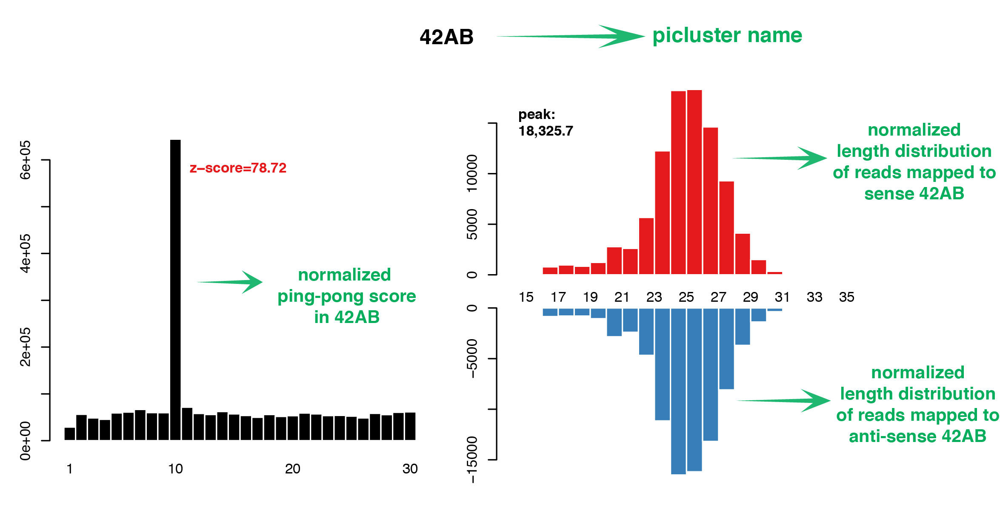

# bed2_summary
get smallRNAseq summary in piclusters, transposons and genes from bed2 files generated by piPipes or other softwares
***
## installation
For easy install, run install.sh in *bed2_summary* folder after download and unzip the source code. It will add all the scripts needed into your PATH and PYTHONPATH. After installation, please use `source ~/.bashrc` or re-load the server.
***
## input
*bed2_summary* need 5 input (6th is alternative):
1. bed2 file of reads directly mapped to piclusters, all mapped and no size selected. For piPipes results, it is usually in `transposon_piRNAcluster_mapping_normalized_by_xxx/xxx.x_rRNA.transposon.a1.insert.bed2`.
2. bed2 file of reads directly mapped to transposons, all mapped and no size selected. For piPipes results, it is usually in `transposon_piRNAcluster_mapping_normalized_by_xxx/xxx.x_rRNA.piRNAcluster.a1.insert.bed2`.
3. bed2 file which contains reads used as normalization factor. eg: normalize by miRNA by using `hairpins_mapping/xxx.x_rRNA.hairpin.xxx.bed2` in piPipes result; normalie by unique mapped reads except miRNA and rRNA by using `genome_mapping/xxx.x_rRNA.x_miRNA.xxx.unique.bed2` in piPipes result; or any other bed2 files in different case.
4. bed2 file of reads mapped to genome after removing rRNA and miRNA reads, all mapped and no size selected. For piPipes results, it is usually in `genome_mapping/xxx.x_rRNA.x_miRNA.xxx.all.bed2`.
5. output prefix name included folder name. eg: /home/bed2_summary/example.
6. Thread number for running. In deafult *bed2_summary* will only use 1 thread.
***
## output
*bed2_summary* can give three summary files: `prefix.picluster.summary`, `prefix.transposon.summary` and `prefix.gene.summary` which summarize informations for each picluster, transposon or gene in each row. And there are 10 columns in xxx.summary:
1. normalized sense+unique mapped reads.
2. normalized antisense+unique mapped reads.
3. normalized sense+all mapped reads.
4. normalized antisense+all mapped reads.
5. normalized sense+unique mapped small RNA species.
6. normalized antisense+unique mapped small RNA species.
7. normalized sense+all mapped small RNA species.
8. normalized antisense+all mapped small RNA species.

*bed2_summary* can also output three pdf files for piclusters, transposons and genes respectively. In the pdf files, ping-pong score, length distribution for each element is included.

## contact
please send questions or bugs to yutianxiong@gmail.com

